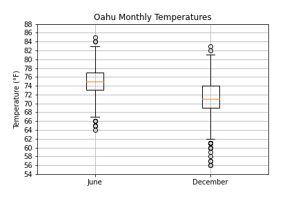
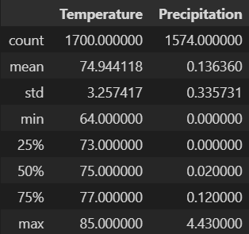
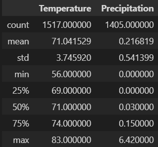
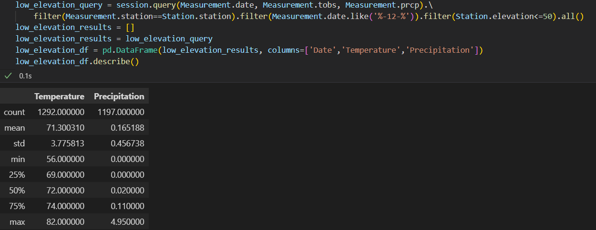
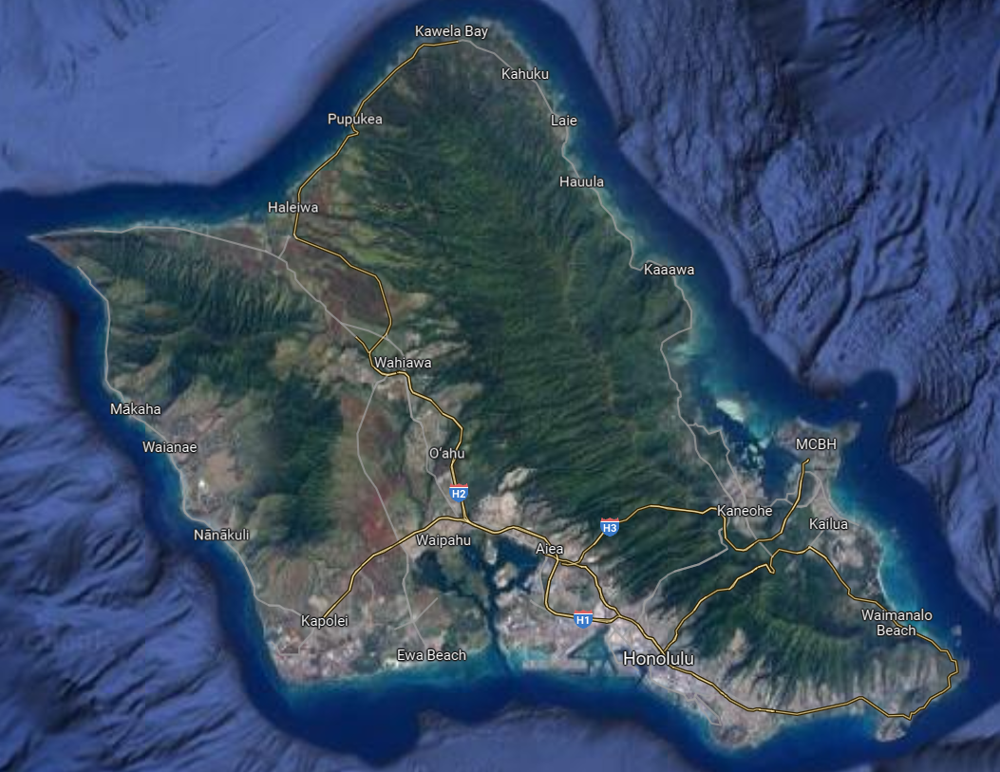

# Surfs_Up

## Overview of the analysis: 
<!-- Explain the purpose of this analysis. -->
The analysis in this project will provide an overview of temperature readings from 2011 to 2017 on the island of Oahu. This analysis is intended to assist in the development process of an ice cream shop on that island.

## Results: 
<!-- Provide a bulleted list with three major points from the two analysis deliverables. Use images as support where needed. -->

For each of the analyses provided, refer to the underlying Figures to view the data upon which the conclusions are based.

* The average temperature remains slightly above 70°F throughout the year.
    * In Fig 2 it is seen that the mean and median temperatures for June are approximately 75°F
    * In Fig 3 it iseen that the mean and median temperatures for December are approximately 71°F
    * Knowing that June is typically one of the warmest months of the year, and December is typically one of the coldest months, it can be safely assumed that the mean and median temperatures will remain relatively close to each of these values for the remaining 10 months.

* The range of temperatures stayed within a 30 degree interval during the collected dates.
    * In Fig 2 it is seen that the maximum temperature is 85°F.
    * In Fig 3 it is seen that the minimum temperature is 56°F.
    * The range between those recorded values is 29°F.

* The difference in "cold days" is more pronounced throughout the year than the difference in "hot days"
    * When referencing Fig 1 (alternatively, referencing Fig2 and Fig3 simultaneously), the range between the minimum values for the months is 8°F (56 compared to 64)
    * The range between the maximums is 2°F (83 compared to 85)
    * The quartiles similarly follow a pattern where the difference in Q1's is more significant than the difference in Q3's.
    * This pattern seems to suggest that the hot days will be consistently in the 80°F range, while the cold days are more apt to vary between the 50's and 60's.

**FIGURE 1 - Double box-plot showing June and December temp. distributions**

**FIGURE 2 - Descriptive Summary of June Data**

**FIGURE 3 - Descriptive Summary of December Data**

## Summary: 
<!-- Provide a high-level summary of the results and two additional queries that you would perform to gather more weather data for June and December. -->

### Referencing Precipitation:

While the data included in the two databases is somewhat limited in focus, there are still several avenues that could be explored to determine optimal conditions for the success of the new business. One such avenue would be to identify the average levels of precipitation for each month. This would be easily accomplished using the "prcp" field already included in the "Measurement" database. In the requested deliverables the only data which was queried was the "Measurement.date" and "Measurement.tobs"(observed temperature). It would be simple to add in a third field to that same query to also request the "Measurement.prcp" values, without any need to join in new databases or reformat the regex statement that limited results to specific months.

### Referencing Elevation:

Another possible avenue would be to filter results based on location criteria. Of the 7 stations providing measurements, 5 stations are located between 0-33m above sea level, while another 2 stations are located 150 and 300m above sea level. It is still relatively straightforward to filter the data based on this new criteria, although now the query would have to adjust to join in the second "Station" database which contains information on the station locations. To accomplish this using the 'session.query()' method there would need to be a filter indicating the fields on which to join the databases ("filter(Measurement.station==Station.station)") and then a second filter acting like a "where" clause which would limit to elevations below 33m ("filter(Station.elevation>50)"). This would be in addition to the existing regex filter used to limit the query to a specific month ("filter(Measurement.date.like('%-12-%'))").

An example of the above "low elevation" query language for December and the summative data resulting from the query is included below for reader reference:

**FIGURE 4 - Descriptive Summary of Low Elevation Data in December**

As can be seen in the figure above, the temperature data is not significantly changed for December and the precipitation data is marginally changed on the high end. Similar effects are observed for the June data as well.

### Referencing Latitude/Longitude:

One additional point to the suggestions above is that it may also be benifical to narrow results to more specific latitude and longitude values (both of which are provided as fields in the "Stations" database). There is also a chance that the topography of the island would impact the temperature and/or precipitation readings, since many of the cities on Oahu lie between two mountain ranges on the east and west sides of the island. For those readers unfamiliar with the island's geography, a picture is included below.

**FIGURE 5 - Image of Oahu's Topography**

Unfortunately, without specific guidance from the project investors it would be difficult to determine which stations should be filtered to provide the most relevant weather data in regards to these locations.

### Closing Suggestions:

In summation, it appears the business venture will be a sound investment in regards to nature's effects. However it is recommended that further analysis be performed to identify the marketability value of another cold-dessert venue on the island, as it would be joining an over-saturated and well established market. Unfortunately the data provided in this analysis is insufficient to determine any effect of that nature.